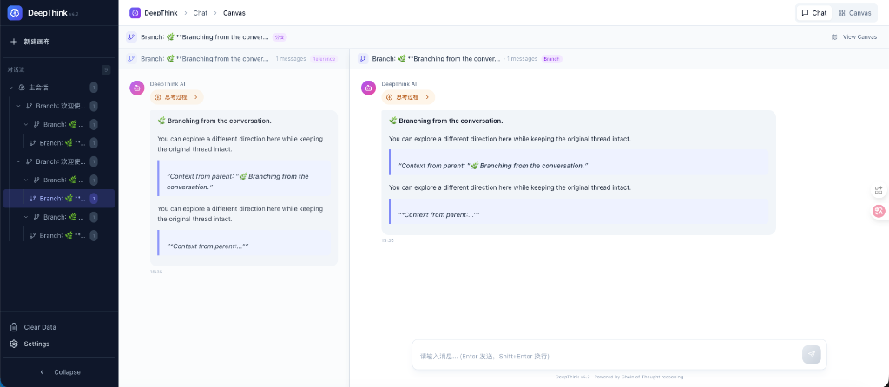

# DeepThink 🧠

> **一款支持无限画布与 DeepSeek R1 思维过程可视化的 AI 对话助手**

<div align="center">


*Canvas 模式：以节点树形式展示所有对话分支，支持无限画布缩放与平移*

</div>

## 📖 简介

DeepThink 是一个基于 Next.js 构建的现代化 AI 对话应用。它独特地将 DeepSeek R1 模型的"链式思维"（Chain of Thought）过程可视化，让用户可以观察 AI 的推理过程。同时，应用支持分支对话功能，使用节点式画布（React Flow）展示对话树，实现非线性的思维探索。

<div align="center">



*Chat 模式：70/30 专注分屏布局，左侧为当前分支，右侧为父级上下文*

</div>

## ✨ 核心特性

### 🔍 深度思考可视化
- 解析并展示 DeepSeek R1 模型的 `<think>` 标签内容
- 可折叠的思维过程面板，兼顾阅读体验

### 🌳 双视图模式
- **Chat 模式**：70/30 专注分屏布局，同时显示当前分支与父级上下文
- **Canvas 模式**：基于 React Flow 的节点式对话展示，支持无限画布

### 🌿 分支对话
- 从任意 AI 回复创建分支，探索不同对话路径
- 分支自动继承祖先上下文，保持对话连贯性
- 侧边栏显示完整对话流树结构

### 📝 丰富的内容渲染
- Markdown 渲染（加粗、斜体、列表等）
- 代码块语法高亮 + 一键复制
- LaTeX 数学公式支持（KaTeX）

### 💾 本地持久化
- 使用 SQLite + Prisma 保存对话历史
- 支持多会话管理

## 🛠️ 技术栈

| 分类 | 技术 |
|------|------|
| 框架 | Next.js 14 (App Router) |
| 语言 | TypeScript |
| 样式 | Tailwind CSS + JetBrains Mono |
| UI 组件 | Shadcn UI + Radix UI |
| 画布 | React Flow + Dagre |
| 数据库 | SQLite + Prisma ORM |
| Markdown | react-markdown + KaTeX |
| 图标 | Lucide React |

## 🚀 快速开始

### 1. 克隆项目

```bash
git clone https://github.com/your-username/deepthink.git
cd deepthink
```

### 2. 安装依赖

```bash
npm install
```

### 3. 配置环境变量

```bash
cp .env.example .env.local
```

编辑 `.env.local`：

```env
# DeepSeek API 密钥（必填）
DEEPSEEK_API_KEY=sk-your-api-key

# 可选：自定义 API 地址
DEEPSEEK_BASE_URL=https://api.deepseek.com

# 可选：模型名称
DEEPSEEK_MODEL=deepseek-reasoner

# 数据库路径
DATABASE_URL="file:./dev.db"
```

### 4. 初始化数据库

```bash
npx prisma db push
```

### 5. 启动开发服务器

```bash
npm run dev
```

访问 [http://localhost:3000](http://localhost:3000)

## 📝 使用说明

| 操作 | 说明 |
|------|------|
| **发送消息** | 输入框输入问题，按 Enter 发送 |
| **查看思考过程** | 点击"思考过程"展开/收起 AI 的推理过程 |
| **创建分支** | 在 AI 回复上点击分支按钮（Chat）或圆形按钮（Canvas） |
| **切换视图** | 右上角 Chat / Canvas 按钮切换视图模式 |
| **划词操作** | 选中 AI 回复文字，进行"解释"、"举例"或"引用" |
| **新建会话** | 侧边栏点击"新建画布"创建独立对话空间 |

## 📁 项目结构

```
deepthink/
├── app/                    # Next.js App Router
│   ├── api/chat/           # 流式聊天接口
│   └── page.tsx            # 主页面（Chat/Canvas 视图）
├── components/
│   ├── chat/               # 聊天组件（消息、输入、分屏布局）
│   ├── graph/              # 画布组件（节点、边、控制器）
│   └── layout/             # 布局组件（侧边栏、外壳）
├── contexts/
│   └── canvas-context.tsx  # 全局状态管理
├── types/                  # TypeScript 类型
└── prisma/                 # 数据库配置
```

## 📄 许可证

MIT License

---

**Made with ❤️ by DeepThink Team**
